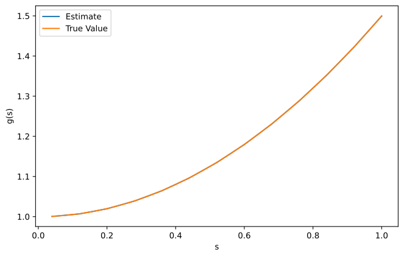
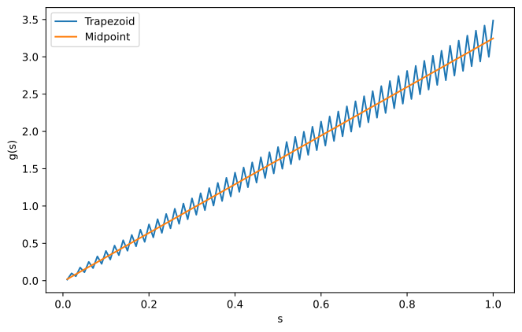

Volterra Integral Equations
===========================

First Kind
----------

This package provides the function :code:`SolveVolterra` which approximates the solution to the Volterra Integral Equation of the first kind using the method in `Betto and Thomas (2021)`_. 

.. autofunction:: inteq.SolveVolterra

Example
^^^^^^^

|example of first kind vie|

.. literalinclude:: ../../example/volterra-example.py
    :language: python

Trapezoid vs Midpoint Rule
^^^^^^^^^^^^^^^^^^^^^^^^^^

Volterra integral equations are typically solved using the midpoint
rule. However, the trapezoid rule often converges faster. See below an
example of the trapezoid rule performing well with just six grid points.

|example of trapezoid rule converging faster|

Thus, the trapezoid rule typically performs better. However, the
trapezoid rule is less stable than the midpoint rule. An example where
this this instability is an issue is provided below.

|example of trapezoid rule having issues|

This can be remedied by smoothing the function. For example, with
:func:`inteq.helpers.smooth`.

Second Kind
-----------

Implementation forthcoming.

.. _`Betto and Thomas (2021)`: https://mattwthomas.com/papers/asymmetric-all-pay-contests-with-spillovers/

.. |example of trapezoid rule converging faster| image:: trap-vs-mid1.svg
